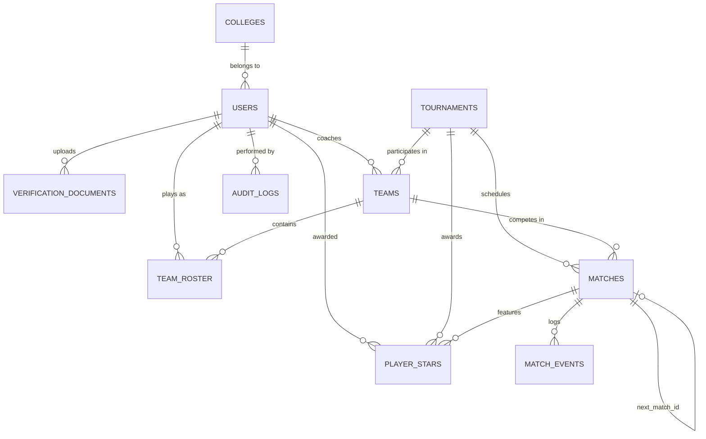
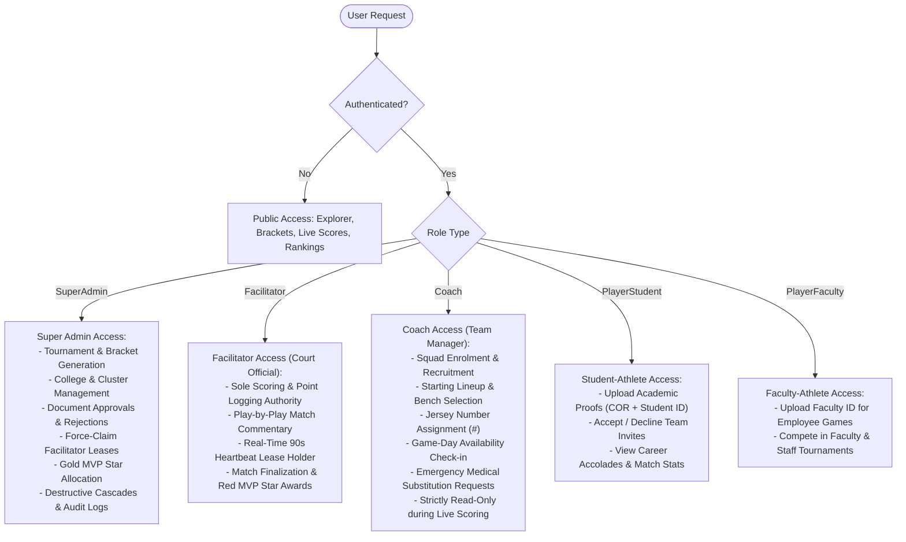

# PSU SportsTrack — System Context & Technical Master Specification

> **AI Context Briefing & Technical Master Document**  
> **System Name:** PSU SportsTrack (Official Sports Tracking & Tournament Management Portal)  
> **Institution:** Palawan State University (PSU)  
> **Target Audience:** AI Agents, Developers, System Architects, Technical Writers, and Capstone Committees.

---

## 1. Executive Summary & Domain Scope

**PSU SportsTrack** is an enterprise-grade, real-time sports tournament management, athlete eligibility verification, and live match scoring platform tailored specifically for **Palawan State University (PSU)**.

### Primary Objectives
1. **Automate Tournament Lifecycles**: Coordinate multi-sport university events (e.g., *PSU Binturungan*, *STRASUC*, *Faculty & Staff Friendly Games*) across all stages: Draft $\rightarrow$ Registration Open $\rightarrow$ Ongoing (Live Brackets) $\rightarrow$ Completed.
2. **Athlete Verification & Anti-Mercenary Governance**: Enforce strict student-athlete eligibility validation via two-factor credential uploads (Certificate of Registration + Official PSU Student ID) with 60-second expiring secure signed preview URLs and cross-team sport exclusivity rules.
3. **Real-Time Match Operations**: Broadcast live play-by-play commentary, instantaneous score synchronization (<300ms latency), and automated tournament tree winner advancement via WebSockets.
4. **Institutional Analytics & Gamification**: Track university college standings, cumulative win statistics, and player accolades using a dual-tier Star system (Per-Match Red Stars & Tournament Gold Stars).

---

## 2. Technology Stack & Infrastructure

```
Frontend:
  ├── Framework: React 19 (TypeScript 6, Vite 8 with SWC)
  ├── Styling: Tailwind CSS 3, Shadcn UI / Radix UI Primitives, Lucide Icons
  ├── Forms & Validation: React Hook Form + Zod Schema Validation
  ├── Notifications: Sonner Toasts
  └── Routing: React Router DOM v7 (SPA with Protected Route Guards)

Backend / BaaS (Supabase):
  ├── Database: PostgreSQL with Row Level Security (RLS) policies
  ├── Authentication: Supabase Auth (JWTs, PKCE password recovery, automatic token refresh)
  ├── Realtime Engine: WebSocket Broadcast Channels + PostgreSQL Change Replication
  └── Storage: Supabase Storage (`verification_documents` bucket with signed URLs)

Testing & Tooling:
  ├── E2E Testing: Playwright
  └── Bundling & Code Quality: Vite, ESLint, TypeScript Compiler (strict mode)
```

---

## 3. Database Schema & Relational Models

The platform is powered by 10 relational PostgreSQL tables:



### Table Specifications

| Table Name | Description | Key Columns | Relationships / Constraints |
| :--- | :--- | :--- | :--- |
| **`colleges`** | Academic colleges/units within PSU | `id` (UUID, PK), `college_name` (Text), `created_at` | Referenced by `users.college_id` |
| **`users`** | Public user profiles extending `auth.users` | `id` (UUID, PK), `full_name`, `role` (`'Admin'\|'Coach'\|'Player'`), `college_id` (UUID), `is_verified` (Boolean), `created_at` | FK to `colleges.id` |
| **`verification_documents`** | Athlete identity & enrollment proofs | `id` (UUID, PK), `user_id` (UUID), `document_type` (`'COR'\|'Valid ID'`), `storage_path` (Text), `status` (`'Pending'\|'Approved'\|'Rejected'`), `created_at` | FK to `users.id` |
| **`tournaments`** | Sports tournament competitions | `id` (UUID, PK), `name`, `sport`, `type` (`'Binturungan'\|'STRASUC'\|'Faculty and Staff Friendly Games'`), `status` (`'Draft'\|'Registration Open'\|'Ongoing'\|'Completed'`), `start_date`, `end_date` | Referenced by `teams`, `matches`, `player_stars` |
| **`teams`** | College squads registered for a tournament | `id` (UUID, PK), `name`, `coach_id` (UUID), `tournament_id` (UUID), `status` (`'Pending'\|'Approved'\|'Rejected'`), `created_at` | FK to `users.id`, `tournaments.id` |
| **`team_roster`** | Athlete memberships in teams | `id` (UUID, PK), `team_id` (UUID), `player_id` (UUID), `status` (`'Pending'\|'Approved'\|'Rejected'`), `created_at` | FK to `teams.id`, `users.id` |
| **`matches`** | Tournament fixtures & bracket nodes | `id` (UUID, PK), `tournament_id` (UUID), `team_a_id` (UUID, nullable), `team_b_id` (UUID, nullable), `team_a_score` (Int), `team_b_score` (Int), `status` (`'Scheduled'\|'Ongoing'\|'Completed'`), `round` (Text), `venue` (Text), `next_match_id` (UUID, self-reference), `next_match_slot` (`'team_a'\|'team_b'`), `created_at` | FK to `tournaments.id`, `teams.id`, self `matches.id` |
| **`match_events`** | Real-time play-by-play commentary log | `id` (UUID, PK), `match_id` (UUID), `description` (Text), `created_at` | FK to `matches.id` |
| **`player_stars`** | MVP Accolades (Per-match / Tournament) | `id` (UUID, PK), `player_id` (UUID), `star_type` (`'Red'\|'Gold'`), `match_id` (UUID, nullable), `tournament_id` (UUID, nullable), `created_at` | FK to `users.id`, `matches.id`, `tournaments.id` |
| **`audit_logs`** | Administrative immutable action log | `id` (UUID, PK), `admin_id` (UUID), `action` (Enum), `entity_type` (Text), `entity_id` (Text), `details` (Text), `created_at` | FK to `auth.users.id` |

---

## 4. User Roles & Permission Matrix (RBAC)

The system enforces five granular institutional roles plus unauthenticated public access:



---

## 5. Core Architectural Workflows

### 5.1. Authentication & Security Policy
* **Brute-Force Protection**: Tracks failed login attempts in client state. Reaching **3 consecutive failed attempts** triggers an automatic **5-minute cooldown (300 seconds)** with a live real-time countdown timer.
* **Lockout Recovery Trigger**: Upon the 3rd failed attempt, the system automatically opens a modal offering to dispatch a password recovery link to the user's email.
* **Password Validation**:
  * Registration / Sign-in: Minimum 6 characters with confirmed password match (`zodResolver`).
  * Reset Password: Minimum 8 characters with PKCE OTP token verification (`supabase.auth.verifyOtp`).
* **Session Persistence**: Initialized with `persistSession: true` and `autoRefreshToken: true` in `src/lib/supabase.ts`.

### 5.2. Athlete Verification & Anti-Mercenary Pipeline
* **Document Proofs**: Student-athletes submit Certificate of Registration (COR) and Official Student ID (`verification_documents`).
* **Expiring Signed Previews**: 60-second TTL on administrative review URLs.
* **Sport Exclusivity**: Roster recruitment checks ensure an athlete cannot be active on multiple teams competing in the same sport.
* **Emergency Medical Substitution**: When a tournament is `Ongoing` and rosters are frozen, Coaches can submit an emergency substitution request with medical justification for Admin approval, drawing solely from verified unrostered students of the same college.

### 5.3. Tournament Creation & Multi-Sport Batch Wizard
* **Binturungan One-Click Setup**: Automatically scaffolds all standard university sports in batch (Basketball, Volleyball, Soccer, Badminton, Baseball, Futsal, Table Tennis).
* **Single Tournament Setup**: Allows ad-hoc custom competitions and formats.

### 5.4. Single-Elimination Binary Tree Bracket Engine & Bronze Medal Playoff
* **Formula**: For $N$ teams, the engine calculates required rounds $R = \lceil \log_2(N) \rceil$ and total matches $2^R - 1$.
* **BYE Match Handling**: Unpaired seeds are recorded as `'Completed'` ($1 - 0$) and immediately pre-advanced into Round 2.
* **Two-Pass Batch Publisher**:
  1. *Pass 1*: Insert all match records to generate database UUIDs.
  2. *Pass 2*: Map internal node identifiers and update `next_match_id`, `next_match_slot`, and `loser_next_match_id`, `loser_next_match_slot`.
* **Automated 3rd-Place (Bronze Medal) Progression**:
  * Semi-Final matches automatically link losers to a dedicated `round: '3rd Place Playoff'` fixture via `loser_next_match_id`.
  * Visualized directly below the Championship Final on the bracket canvas with amber/bronze styling.
* **Live Winner & Loser Advancement**:
  * **Tie Guard**: Prevents match completion if `team_a_score === team_b_score`.
  * On match completion, winner advances to `next_match_id` and loser (for Semi-Finals) cascades to `loser_next_match_id`.

### 5.5. Realtime Live Scoring, Facilitator Lease & MVP Accolades
* **Facilitator-Only Authority**: Only users with the `facilitator` role (or `super_admin`) have access to scoring buttons, commentary inputs, and match completion actions. Coaches and players are strictly view-only spectators.
* **Single Facilitator Lease Engine**:
  * Managed via `active_scorekeeper_id` and `lease_expires_at` on `matches`.
  * The active Facilitator console sends a 15s heartbeat to maintain a 90s lease window.
  * Superadmins hold a force-claim override button.
* **Dual-Channel Live Synchronization**:
  1. **Broadcast Channel (`match-broadcast:${matchId}`)**: Low-latency (<300ms) peer-to-peer WebSocket event distribution for instantaneous score changes (`score_update`), event additions (`event_update`), and MVP awards (`mvp_update`).
  2. **Postgres Changes Channel (`postgres_changes`)**: Streams database replication events on `matches`, `match_events`, and `player_stars` tables.
* **Court-Side Offline Mutation Queue**:
  * When disconnected from Wi-Fi, score increments and events buffer locally in IndexedDB.
  * Matches can be concluded locally (`"Pending Sync"`).
  * Upon reconnection, mutations are flushed via atomic batch sync RPC `sync_offline_match_events`.
* **MVP Accolades**:
  * **Red Stars**: Match MVP awarded exclusively by the presiding Facilitator or Superadmin at match conclusion.
  * **Gold Stars**: Tournament MVP awarded by Superadmins at tournament completion.

### 5.6. Audit Logging & Capstone Demo Protocol
* **Audit Actions Tracked**: `APPROVE_DOCUMENT`, `REJECT_DOCUMENT`, `CREATE_TOURNAMENT`, `UPDATE_TOURNAMENT`, `DELETE_TOURNAMENT`, `APPROVE_TEAM`, `REJECT_TEAM`, `GENERATE_BRACKET`, `AWARD_STAR`, `EMERGENCY_SUBSTITUTION`.
* **Two-Step Deletion Confirmation**: Deleting a tournament requires typing `DELETE` in a confirmation dialog.
* **Capstone Demo State Reset**:
  * Automated script `npm run seed:demo` restores a pristine showcase state with colleges, active tournament brackets, ongoing matches, and sample verification documents.
  * Guarded in UI by `VITE_ENABLE_DEMO_RESET === 'true'`, Admin authentication, and typing `RESET DEMO`.

---

## 6. Frontend Architecture & Directory Structure

```
d:\Files\PSU-SportsTrack\
├── public/                         # Static assets and icons
├── src/
│   ├── assets/                     # Sports icons and media assets
│   ├── components/
│   │   ├── admin/                  # DataToolbar, ViewToggle, analytics widgets
│   │   ├── auth/                   # LoginModal (sliding auth), VerificationUpload
│   │   ├── layout/                 # Navigation bars, Sidebar logo box
│   │   ├── ui/                     # Shadcn / Radix UI primitives (Dialog, Select, Card, Button)
│   │   ├── AppLayout.tsx           # Application shell layout
│   │   └── ProtectedRoute.tsx      # RBAC Route Guard
│   ├── context/
│   │   └── AuthContext.tsx         # Global session, user profile, and role state
│   ├── hooks/
│   │   └── useAuthRedirect.ts      # Role-based route redirects
│   ├── lib/
│   │   ├── audit.ts                # Centralized audit logging utility
│   │   ├── supabase.ts             # Supabase client configuration
│   │   └── utils.ts                # Tailwind class merge utility
│   ├── pages/
│   │   ├── AdminAuditLogs.tsx       # Realtime audit log explorer with time filters
│   │   ├── AdminDashboard.tsx       # Tournament pipeline, stats, quick admin tools
│   │   ├── AuthConfirm.tsx          # Supabase email confirmation landing
│   │   ├── CoachDashboard.tsx       # Squad status, upcoming match alerts, recruitment
│   │   ├── LiveMatch.tsx            # Live scoring console, WebSockets, MVP star modal
│   │   ├── Login.tsx                # Standalone login fallback with cooldown timer
│   │   ├── NotFound.tsx             # 404 handler with smart role-based redirects
│   │   ├── PlayerDashboard.tsx      # Athlete hub, team invites, active matches
│   │   ├── Profile.tsx              # User profile, college picker, earned stars list
│   │   ├── Ranking.tsx              # Institutional standings and multi-filter leaderboards
│   │   ├── Register.tsx             # Registration form with role & college select
│   │   ├── ResetPassword.tsx        # Password recovery and OTP verification form
│   │   ├── SystemVerifications.tsx  # Document verification queue with signed URLs
│   │   ├── TeamManagement.tsx       # Coach squad creator and roster manager
│   │   ├── TournamentExplorer.tsx   # Public bracket viewer and match center
│   │   └── TournamentManagement.tsx # Bracket generator wizard, deletion & MVP assign
│   ├── App.tsx                     # Root router configuration
│   └── main.tsx                    # Application entry point
├── tests/                          # Playwright E2E test specs
├── PROJECT_STATE.md                # Milestone tracker and completed features
├── local_change_log.md             # Developer prompts and commit audit history
└── package.json                    # Dependencies and scripts
```

### Route Table

| Path | Access Level | Component | Description |
| :--- | :--- | :--- | :--- |
| `/` | Public | `PlayerDashboard.tsx` | Main portal & Athlete Hub |
| `/explorer` | Public | `TournamentExplorer.tsx` | Tournament Explorer & Match Center |
| `/ranking` | Public | `Ranking.tsx` | Institutional Leaderboards & Standings |
| `/match/:matchId` | Public / Role Guarded | `LiveMatch.tsx` | Live Match Scoring & Spectator View |
| `/register` | Public | `Register.tsx` | User Account Registration |
| `/reset-password` | Public | `ResetPassword.tsx` | Password Recovery & Token Exchange |
| `/auth/confirm` | Public | `AuthConfirm.tsx` | Email Verification Handler |
| `/profile` | Authenticated | `Profile.tsx` | User Profile, College, and Accolades |
| `/player` | Player Only | `PlayerDashboard.tsx` | Athlete Dashboard |
| `/coach` | Coach Only | `CoachDashboard.tsx` | Coach Dashboard |
| `/coach/teams` | Coach Only | `TeamManagement.tsx` | Team Formation & Roster Recruitment |
| `/admin` | Admin Only | `AdminDashboard.tsx` | Administrative Overview & Metrics |
| `/admin/tournaments` | Admin Only | `TournamentManagement.tsx` | Tournament & Bracket Wizard |
| `/admin/verifications`| Admin Only | `SystemVerifications.tsx` | Athlete Document Verification Queue |
| `/admin/audit-logs` | Admin Only | `AdminAuditLogs.tsx` | Audit Trail & Event Logs |
| `*` | Public | `NotFound.tsx` | 404 Fallback & Smart Redirector |

---

## 7. Operational Standards & Performance Expectations

1. **Service Availability**: Designed for **99.5% uptime** during collegiate tournament seasons.
2. **WebSocket Broadcast Latency**: Sub-300ms live score delivery to all active clients.
3. **Data Security & Privacy**:
   - Private Supabase Storage bucket for identification documents.
   - 60-second time-to-live (TTL) on administrative document preview URLs.
4. **Client Performance**: Built on Vite 8 and React 19 SWC compilation, delivering initial page load times under 1.5 seconds.
